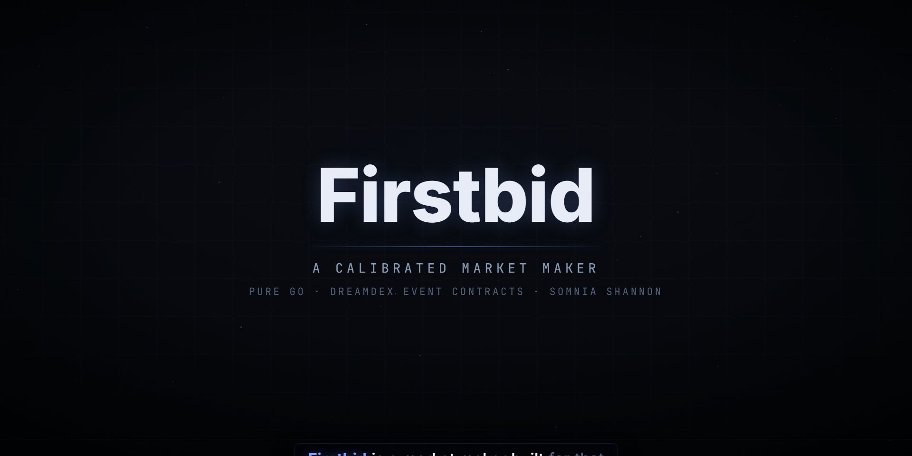
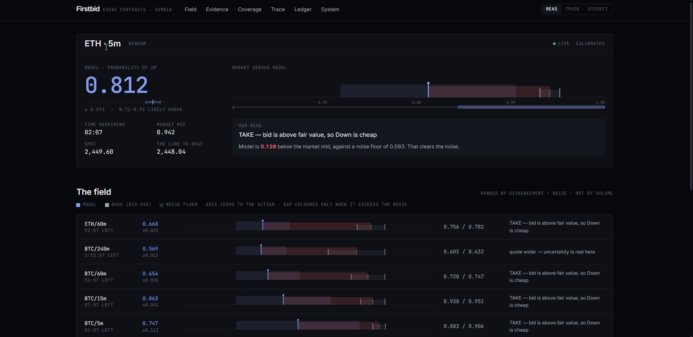
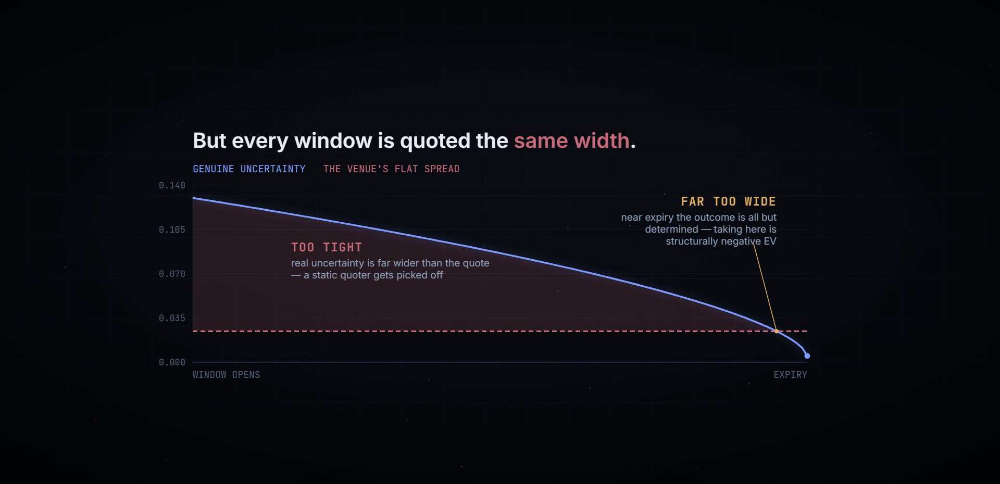
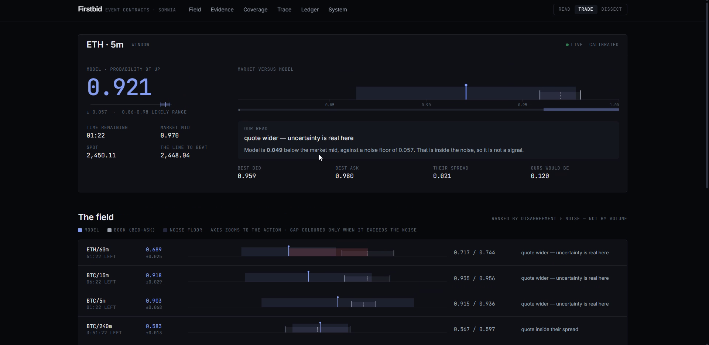
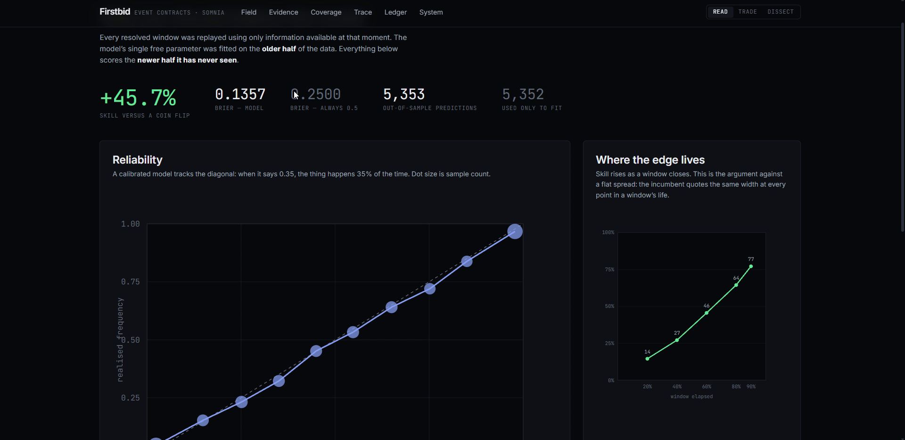
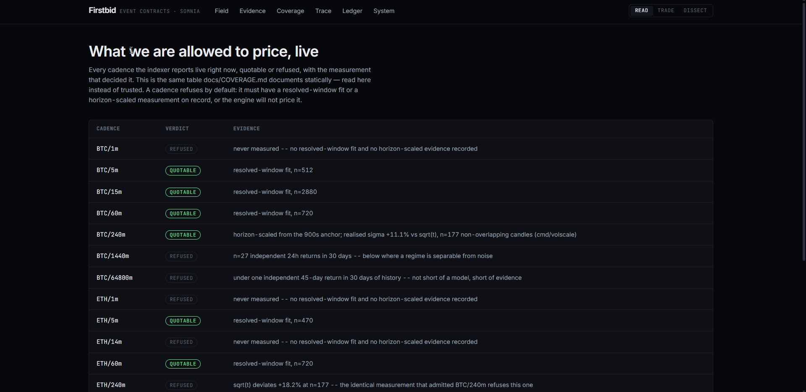
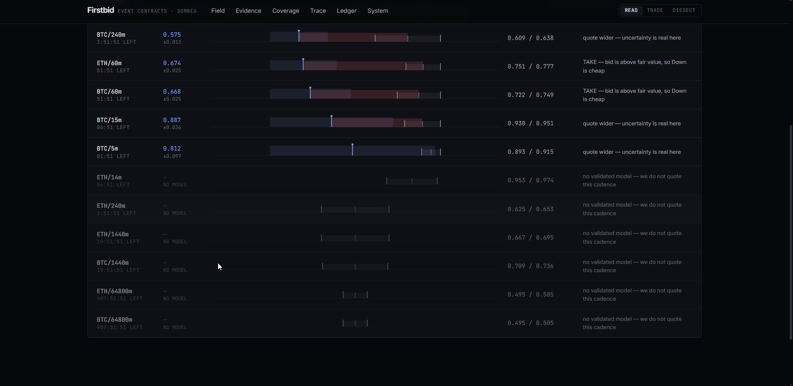
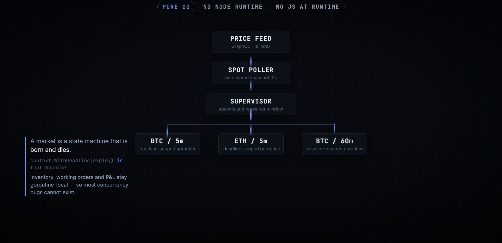
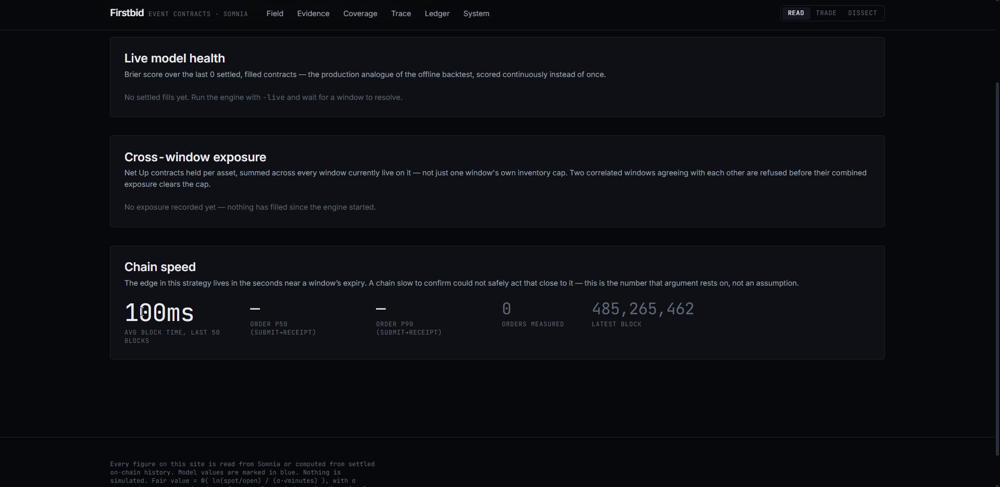

<p align="center">
  
</p>

<h1 align="center">Firstbid</h1>

<p align="center">
  <b>A calibrated market maker for DreamDEX Event Contracts, written in pure Go.</b><br>
  <sub>Somnia × DreamDEX Event Contracts Hackathon submission</sub>
</p>

<p align="center">
  
  
  
  
</p>

<p align="center">
  <a href="https://www.youtube.com/watch?v=peFm2sRl43g">
    
  </a>
</p>

<p align="center">
  <a href="https://www.youtube.com/watch?v=peFm2sRl43g"><b>▶&nbsp; Watch the 4:53 demo</b></a>
  &nbsp;·&nbsp;
  <a href="#running-it">Run it in one command</a>
  &nbsp;·&nbsp;
  <a href="docs/AUTOPSY.md">The bug that cost us 37%</a>
</p>

---

## The one-line version

Event-contract quotes on DreamDEX are flat ladders that ignore how certain the
outcome actually is. Firstbid prices every window against a model validated
out-of-sample on the same 1-second index feed it trades, quotes it correctly,
and takes the book when the book is wrong.

The harder half is knowing **which** windows it may price at all. The model
refuses any cadence it has not validated — and that refusal, honestly measured,
turned out to be excluding **97.9% of the venue's trades**. So we measured σ a
second way, from the index price process rather than the venue's settlement log,
and extended coverage exactly as far as the evidence reached: one cadence
admitted, three still refused. See [`docs/COVERAGE.md`](docs/COVERAGE.md).

It is running on Somnia Shannon right now, and it fills.

<p align="center">
  
</p>
<p align="center">
  <sub>One live ETH/5m window. The model says <b>0.812</b>; the book's mid is <b>0.942</b>. Firstbid takes the bid, because the gap clears its own noise floor.</sub>
</p>

> **Read this before the numbers.** An earlier version of this README claimed
> +59.5% out-of-sample skill. That figure was wrong: our own backtest read the
> index price up to 59 seconds **after** each moment it claimed to predict —
> roughly 1σ at BTC's fitted volatility — which produced a volatility constant
> that made the model badly overconfident. It cost 37% of deployed capital
> across 53 fills.
>
> It was caught twice, independently: in code review, and by the live P&L
> attribution, which showed edge staying positive while selection collapsed —
> the signature of a wrong belief rather than bad execution. Two different
> instruments pointing at one line of code is the reason we trust the diagnosis.
>
> Every figure below is the corrected measurement. Honest out-of-sample skill is
> **+45.7%**. The full post-mortem, including what it cost and the six changes
> that followed, is in [`docs/AUTOPSY.md`](docs/AUTOPSY.md).

---

## The problem, measured

We did not assume anything about this venue. Every number below was measured
directly from the public indexer and the chain on 2026-09-03.

| Measurement                         | Value                       | Source               |
| ----------------------------------- | --------------------------- | -------------------- |
| Binary markets created per day      | ~770                        | indexer              |
| Markets that ever receive a trade   | **19.2%** (1,964 of 10,211) | indexer              |
| Binary fills in 24h (mainnet)       | 155                         | indexer              |
| Distinct wallets trading in 24h     | 54                          | indexer              |
| Typical quoted spread               | **0.024 – 0.029**           | `pool.getBookLevels` |
| P(Up) across 10,209 settled windows | **0.4978**                  | oracle answers       |
| Winning positions redeemed          | 99.4% (25,496 of 25,660)    | `OutcomeBalance`     |
| Voided markets observed             | 0 of ~800                   | indexer              |

> **The venue reshaped, and these figures are dated rather than wrong.** Five
> days later, on 2026-09-08, `cmd/surface` censused the live book and found
> **8 live markets**, not a wide thin cross-section: few, long-dated, and
> heavily traded, with 97.9% of trades on cadences this engine was refusing.
> The measurements above still describe the venue of 2026-09-03 and are kept
> for that reason. The row that matters most — P(Up) = 0.4978 over ten thousand
> settled windows — is a property of the price process and does not move.
> [`docs/COVERAGE.md`](docs/COVERAGE.md) is the re-measurement.

Two conclusions follow, and they point in opposite directions from where most
people start.

**1. Nobody can predict these markets, and it is pointless to try.**
P(Up) = 0.4978 over ten thousand windows. A 15-minute BTC up/down window is a
fair coin. Any product whose pitch is "our AI predicts the direction" is claiming
to beat a martingale.

**2. The money is in the spread, and the spread is mispriced.**
On a contract that pays 1.00, a flat 0.024 spread is simultaneously **too tight
mid-window** — where real uncertainty is ~0.07 and a static quoter gets picked
off — and **far too wide near expiry**, where the outcome is 99.8% determined.
That second half is why the venue has 54 traders: taking is structurally −EV
exactly when people most want to trade.

Firstbid quotes 0.12 wide when uncertainty is real and 0.005 wide when it is not.

<p align="center">
  
</p>
<p align="center">
  <sub>One flat quote against an uncertainty that decays. It is too tight for most of the window, and too wide exactly where people want to trade.</sub>
</p>

Which means the interesting decision is usually **not to trade**:

<p align="center">
  
</p>
<p align="center">
  <sub>The model is <b>0.049</b> from the mid; its own noise floor is <b>0.057</b>. The disagreement is smaller than the model's error, so it is not a signal — and the engine says so, widens to 0.120, and leaves the trade alone.</sub>
</p>

---

## The model

Fair value is the terminal probability that a driftless random walk finishes at
or above where it started:

```
P(Up) = Φ( ln(spot / open) / (σ_min · √minutes_remaining) )
```

No directional view is taken or implied. σ is measured per asset and cadence
from resolved history, never assumed:

| Series   |     n |  P(Up) |    σ/min | evidence           |
| -------- | ----: | -----: | -------: | ------------------ |
| BTC/5m   |   512 | 0.4746 | 0.000513 | resolved windows   |
| BTC/15m  | 2,880 | 0.4997 | 0.000504 | resolved windows   |
| BTC/60m  |   720 | 0.5083 | 0.000517 | resolved windows   |
| BTC/240m |   177 |      — | 0.000560 | **horizon-scaled** |
| ETH/5m   |   470 | 0.4936 | 0.000683 | resolved windows   |
| ETH/15m  | 2,880 | 0.5083 | 0.000681 | resolved windows   |
| ETH/60m  |   720 | 0.5111 | 0.000707 | resolved windows   |

σ/min is stable within an asset across a 12× range of window lengths. That is
the √t scaling the model assumes, **measured rather than asserted**.

The BTC/240m row is the one entry not fitted from resolved venue windows,
because the venue has never settled enough 4-hour windows to fit one. Its `n` is
177 _non-overlapping 4-hour index returns_, not 177 settled markets — which is
why `Vol` now carries a `Source` field, so the provenance travels with the
number. [`docs/COVERAGE.md`](docs/COVERAGE.md) is how it was measured and why
only the horizon _ratio_ was imported rather than the absolute level.

### Validation — this is the part that matters

<p align="center">
  
</p>
<p align="center">
  <sub>Fitted on the older half, scored on the newer half it has never seen. The reliability curve tracks the diagonal.</sub>
</p>

`cmd/backtest` replays every resolved window using **only information observable
at each moment**, fits the one free parameter on the **older half**, and scores
the **newer half it has never seen**.

The words "observable at each moment" are load-bearing, and getting them wrong is
what cost us 37%. `venue.SpotSeries` now stamps every price with the time it
became knowable and refuses to serve anything later, and the default replay reads
the same 1-second `PricePoint` feed the live engine polls — so backtest and
production cannot disagree about what was known when.

The split is drawn between **whole windows**, never between rows. Each window
contributes one prediction per sampled fraction, all five carrying that window's
single outcome; a split at the row midpoint would put some of a window's rows in
train and the rest in test, letting the same coin flip both fit the calibration
and score it. The counts below were produced by the earlier row-level split —
`5,352` is not a multiple of five, which is what exposed the leak — so the
out-of-sample figures should be read as approximate until the numbers are
regenerated on a leak-free split.

```
$ go run ./cmd/backtest -feed=points -window=96h

resolved windows: 2,193      predictions: 10,705
train/test split: 5,352 train (older) / 5,353 test (newer)
k fitted on TRAIN only = 0.710

OUT-OF-SAMPLE RELIABILITY
bucket        n   predicted  realised    err
0.0-0.1    1092     0.023     0.044    +0.020
0.1-0.2     400     0.148     0.152    +0.004
0.2-0.3     466     0.251     0.232    -0.019
0.3-0.4     422     0.350     0.322    -0.028
0.4-0.5     412     0.449     0.451    +0.002
0.5-0.6     443     0.548     0.533    -0.015
0.6-0.7     420     0.650     0.640    -0.010
0.7-0.8     350     0.752     0.720    -0.032
0.8-0.9     346     0.850     0.838    -0.012
0.9-1.0    1002     0.978     0.967    -0.011

Brier (model)      : 0.1357
Brier (always 0.5) : 0.2500
skill score        : +45.72%
```

No decile is off by more than **0.032**, and at the opening tick — where spot
equals open — the formula returns exactly 0.500 against a measured base rate of
0.4978. It reproduces a number it was never told.

That block is the run that produced [`docs/calibration.json`](docs/calibration.json),
which is what the dashboard renders. Re-running it will not reproduce these
figures exactly: `-window=96h` is relative to now, so each run samples a slightly
later 96 hours of a live venue. Expect the third decimal to move and the
conclusion not to. Measured 2026-09-03.

**A negative result we kept.** Under the old constant the honest reliability
curve was strongly S-shaped, which a single σ multiplier cannot fix — so we built
one: `internal/model/calibmap.go` fits a monotone isotonic map from raw
probability to observed frequency on the older half and scores it on the newer
half.

It did not earn its place. With the look-ahead removed and σ refitted honestly,
the S-shape largely disappeared, and the map then made calibration **worse** out
of sample — Brier 0.1357 raw against 0.1368 mapped over 5,353 held-out
predictions. With 12 knots of 446 observations each it was fitting the training
half's noise. So `fittedKnots` is empty, the map is the identity, and the scalar
stands alone. `cmd/backtest` prints that verdict on every run, and the code stays
for the day a larger sample shows real curvature.

**What survived is the floor.** `model.CalibrationError = 0.045` is the largest
out-of-sample decile error across both replay series, and **every take must clear
it**. The trade that lost the money was a 0.03 edge on a belief whose own error
was larger than the edge. An edge smaller than the model's error is not an edge —
and the old 0.020 threshold was never a threshold at all.

**Cross-checked on a second series, and k moves.** `-feed=candles -window=720h`
replays 30 days of M1 candles instead of 4 days of the 1-second feed, and fits
`k = 0.635` rather than `0.710` — same conclusion, 12% apart. Volatility regime,
not a bug: the longer sample averages more of it. We ship the higher value,
because a larger σ means less confident probabilities, and overconfidence is the
specific failure that cost us 37%. Under-confidence only forgoes trades.

**We refuse to quote what we have not validated — and we were wrong about what
counts as validation.** Long-dated windows have no resolved venue history to fit,
so the engine skipped them rather than extrapolating √t four times further than
it was tested. The refusal was right. Its stated reason was too strong: "no
resolved venue history" is not "no evidence," because σ is a property of the
index price process and the settlement log is only one way to observe it.

A census of the live book found what the overreach cost — **187 of 191 trades
(97.9%) and ~99% of quote volume on the cadences we were refusing**, and **411 of
429 legs (95.8%) across 72 complete polls** resting on a cadence we had no
opinion about. Depth is not the argument: nearly all of it sits on the one
cadence that stays refused. So `cmd/volscale` measures σ from
30 days of M1 candles using non-overlapping returns, and it agrees with the
resolved-window fit to within **5.3%** — two independent estimators sharing no
data and no code path. √t then holds to +11.1% at a 240-minute aggregation for
BTC, and the same measurement refuses ETH/240m at +18.2% and everything at
1440m and beyond for want of independent observations.

One cadence admitted, three still refused, and four tests keep it that way. The
deepest book on the venue is still not quoted: it is not short of a model, it is
short of evidence. [`docs/COVERAGE.md`](docs/COVERAGE.md).

<p align="center">
  
</p>
<p align="center">
  <sub>Every cadence carries the measurement that admitted or refused it. <code>ETH/240m</code> is rejected by the identical test that admitted <code>BTC/240m</code>.</sub>
</p>

The same refusal shows up live, per window, in the field:

<p align="center">
  
</p>

---

## Architecture

Pure Go. No Node, no JavaScript runtime, no SDK dependency at runtime.

<p align="center">
  
</p>

```
                    ┌──────────────────┐
   price feed ─────▶│  spot poller     │  one shared snapshot, 2s
   (GraphQL)        └────────┬─────────┘
                             │
   indexer ────▶ ┌───────────▼───────────┐
   (discovery)   │      supervisor       │ spawns/reaps per window
                 └───────────┬───────────┘
                             │
              ┌──────────────┼──────────────┐
              ▼              ▼              ▼
        marketLoop     marketLoop     marketLoop     one goroutine per
        (BTC/15m)      (ETH/5m)       (BTC/60m)      live window, each
              │              │              │        deadline-scoped to
              └──────────────┼──────────────┘        its own expiry
                             │  intents (buffered)
                             ▼
                 ┌───────────────────────┐
                 │   ONE executor        │  serialised: one signer,
                 │   goroutine           │  one nonce sequence
                 └───────────┬───────────┘
                             ▼
                   Somnia chain (50312)
```

**Why one goroutine per window:** a market is a finite state machine
(`Listed → Trading → Locked → Resolved`) that is born and dies. A goroutine
scoped by `context.WithDeadline(expiry)` _is_ that state machine — inventory,
working orders and P&L are goroutine-local, so most concurrency bugs cannot
exist. Cadences run from 5 to 60 minutes simultaneously; a single sweep loop
would have to pick one tick rate and would either burn RPC on long windows or
under-serve short ones.

**Why exactly one writer:** one signing key means one nonce sequence. N
goroutines may _decide_ concurrently; only one may _write_.

### Zero-inventory two-sided quoting

Up and Down share a single book quoted in Up terms. When a Buy Up crosses a Buy
Down, the pool **mints a fresh pair** from their combined collateral — no seller
needed. So a resting Buy Up at _p_ plus a Buy Down at _q_ is a complete
two-sided quote requiring **no inventory and no directional risk**: a matched
pair always redeems to exactly 1.00, whoever wins.

We measured `MINT_A_PAIR` at 22–42% of all fills on this venue. The mechanism is
real and load-bearing.

---

## P&L attribution

Event contracts have a property no other DeFi primitive has: **every position
reaches a terminal, exact, verifiable value within an hour.** No mark-to-model,
no open-ended exposure. That makes profit arithmetic, and it lets us split it
into the part we controlled and the part we did not:

```
Edge      = Σ (fair − price) × qty     what we believed we captured
Selection = Σ (value − fair) × qty     how the outcome differed from that belief
Net       = Edge + Selection
```

Edge is skill. Selection is variance, and over many windows it should average
toward zero if the model is calibrated. Reporting them separately is the
difference between _"we made money"_ and _"we know why."_

---

## It works, live

```
[BTC/5m] t-179s fair=0.381 book=0.226/0.253
         TAKE BUY_UP edge=0.128 (ask is below fair value)
SENT     BTC/5m BUY_UP 0.258 x2.0  rested=false fills=1
         tx=0x68a65b06c787e17025e98c162483abf1a16cea7a86a4473ddc3acec5896575c6
```

The model priced the contract at 0.381; the incumbent was asking 0.253; we
crossed and filled. Verifiable on the
[Shannon explorer](https://shannon-explorer.somnia.network).

And it keeps score on itself — including the two numbers that make this strategy
tradeable on Somnia specifically:

<p align="center">
  
</p>
<p align="center">
  <sub><b>100ms</b> average block time is the number the whole edge rests on: the edge lives in the seconds near expiry, and a chain slow to confirm could not safely act that close to it.</sub>
</p>

---

## Safety

A maker that guesses pays. Every gate below is enforced before an order is signed:

| Gate                            | Behaviour                                                                                                                                                                                                      |
| ------------------------------- | -------------------------------------------------------------------------------------------------------------------------------------------------------------------------------------------------------------- |
| On-chain status                 | Only `Trading` (1). The indexer's status lags by seconds.                                                                                                                                                      |
| Uncalibrated series             | Refused outright — no model, no quote. A cadence enters the table only on its own passing measurement; ETH/240m and everything at 1440m and beyond are still refused, including the deepest book on the venue. |
| Stale index price               | Refuses to quote if spot is older than 10s.                                                                                                                                                                    |
| Window about to lock            | Refuses inside the final 20s.                                                                                                                                                                                  |
| Inventory caps                  | Stops quoting the side that would deepen an oversized position.                                                                                                                                                |
| Order expiry                    | Mandatory, capped at the market's own — a dead-man's switch.                                                                                                                                                   |
| Grid snapping                   | Prices to tick, sizes floored to lot; a zero result skips the order.                                                                                                                                           |
| Cancel-replace                  | Every resting order pulled before requoting, read from the pool.                                                                                                                                               |
| Take threshold                  | Must clear a fixed edge, the model's forward uncertainty, **and** its measured calibration residual at that probability.                                                                                       |
| Takes answer to the quote gates | Crossing is a write, so it re-uses every pre-signing check the maker path respects: stale spot, imminent lock, certainty bounds, inventory caps. A take that skipped them would route around all of them.      |
| Per-window take budget          | At most 2 crossings, 15 collateral, and one per 45s. Takes inside a window are perfectly correlated, so repeating one is not diversification.                                                                  |
| Unsupported certainty           | The calibration map clamps outside its fitted range instead of extrapolating toward 0 or 1.                                                                                                                    |
| Mainnet                         | `-live` refuses to run on mainnet. Testnet only.                                                                                                                                                               |

The last three exist because of a specific loss, not in principle. See
[`docs/AUTOPSY.md`](docs/AUTOPSY.md).

---

## Running it

```bash
cd core
go run ./cmd/status                          # signer, gas, collateral
go run ./cmd/setup                           # mint 10,000 tUSDC
go run ./cmd/firstbid -net=testnet           # DRY RUN — prices, never signs
go run ./cmd/firstbid -net=testnet -live     # rest real orders
```

Analysis and verification:

```bash
go run ./cmd/calibrate    # fit sigma per asset and cadence
go run ./cmd/volscale     # sigma from price history + per-horizon sqrt(t) verdict
go run ./cmd/surface      # live book census: what co-exists, and what is inconsistent
go run ./cmd/backtest     # replay + out-of-sample reliability (1s feed, 24h)
go run ./cmd/backtest -feed=points -window=96h   # the figures quoted above
go run ./cmd/backtest -feed=candles              # coarser M1 cross-check
go test ./internal/venue/ -run SpotSeries -v     # the look-ahead regression tests
go run ./cmd/edge         # live model vs live book
go run ./cmd/mybook       # our resting orders on the real book
go test ./internal/...    # ledger, model, maker, venue
```

Requires `FIRSTBID_PRIVATE_KEY` (a throwaway testnet key) in `executor/.env`.
Gas: [Somnia Shannon faucet](https://cloud.google.com/application/web3/faucet/somnia/shannon).

---

## Docker

The dashboard needs no Node/Go toolchain on the host and no credentials — it
reads the public Somnia Shannon testnet indexer, RPC and price-feed endpoints
that are hardcoded in `internal/venue`. This is the one-command path for a
judge: clone, `docker compose up --build`, open `localhost:8080`.

### Quick start (dashboard only)

```bash
docker compose up --build
```

Open `http://localhost:8080`. Stop with `docker compose down` (add `-v` to
also drop the ledger volume).

### Build and run without Compose

```bash
docker build -t firstbid-dashboard .
docker run --rm -p 8080:8080 -v firstbid-ledger:/data firstbid-dashboard
```

### The engine (optional, off by default)

`docker compose up` starts only the read-only dashboard. The quoting engine
(`cmd/firstbid`) is a second service behind a Compose **profile**, so it never
starts by accident:

```bash
docker compose --profile engine up --build
```

It defaults to **DRY RUN**: it prices live windows and logs the quotes it
would place, but signs nothing, and needs no key. To actually rest orders on
the Shannon testnet book, set `FIRSTBID_PRIVATE_KEY` (see `.env.example`) and
add `-live` to the `engine` service's `command:` in `docker-compose.yml`:

```bash
cp .env.example .env   # fill in a throwaway Shannon testnet key
docker compose --profile engine up --build
```

`-live` refuses to run against mainnet regardless (see [`cmd/firstbid`](core/cmd/firstbid/main.go)) —
never put a real/mainnet key in `.env`.

### Environment variables

| Variable               | Required by                                                 | Notes                                                                       |
| ---------------------- | ----------------------------------------------------------- | --------------------------------------------------------------------------- |
| `FIRSTBID_PRIVATE_KEY` | `engine` service, only when its `command:` includes `-live` | Throwaway Shannon testnet key. Never committed, never baked into the image. |

The `dashboard` service takes no environment variables at all.

### Ports

| Port   | Service     | Purpose                                             |
| ------ | ----------- | --------------------------------------------------- |
| `8080` | `dashboard` | UI + `/api/*` (calibration, live book, P&L, traces) |

### Persistence

Both services can share one SQLite P&L ledger (`internal/ledger`) through the
`ledger` named volume, mounted at `/data`, so the dashboard's P&L panel
reflects fills the engine records. No external database is required.

### Verified

Built and run locally against the live Shannon testnet: image builds
(Next.js static export → embedded into the Go binary → two static, cgo-free
Go binaries on `gcr.io/distroless/static-debian12:nonroot`, ~46 MB), the
container starts as non-root, serves the UI and every `/api/*` route
(`/api/live` returns real BTC/ETH windows read from the public indexer and
price feed), the `engine` profile runs in DRY RUN with no key present, and the
exported image filesystem carries no `.env` or key material.

**Not verified in this environment** (no funded testnet key was available):
`-live` order signing and submission, and P&L accumulating from real fills.
Both paths are unchanged from the existing `go run` flow — Docker only changes
how the same binaries are built and started.

### Troubleshooting

- **`/api/live` returns an empty list or errors** — the container needs
  outbound internet access to `*.somnia.network` / `*.somnia.host`; check
  your Docker network/proxy settings.
- **Engine won't start with `-live`** — `FIRSTBID_PRIVATE_KEY` must be set
  (via `.env`) and `-net=mainnet -live` is refused by design; testnet only.
- **Stale UI after a code change** — `docker compose up --build` (or
  `docker build --no-cache`) to force the Next.js export and Go binaries to
  rebuild; layer caching otherwise reuses the previous `npm ci`/`go build` output.
- **Reset all state** — `docker compose down -v` removes the `ledger` volume
  (the SQLite P&L history) along with the containers.

---

## Repository

```
core/                    the engine — pure Go, no Node
  cmd/
    firstbid/            the quoting engine
    backtest/            replay + reliability + train/test split
    calibrate/           fit sigma per asset and cadence
    volscale/            sigma from the index price process, non-overlapping
                         returns only — blesses or refuses each horizon, and
                         refused half of what it tested
    surface/             live book census — classifies every pair of
                         simultaneous windows, hunts model-free inconsistency,
                         and prints the verdict that killed its own thesis
    edge/                live model vs live book
    mybook/              our resting orders on the real book
    probe/ sides/        venue read verification
    setup/ status/       collateral and readiness
    sidetest/            empirical probe for the NO-price convention
  internal/
    venue/               pure-Go DreamDEX client (+ embedded ABIs)
      pricefeed.go       causal replay series — stamps every price with the
                         time it became knowable, refuses to serve later ones
    model/               calibrated fair value
      calibmap.go        isotonic calibration + the measured edge floor
                         (map built, measured, and deliberately not shipped)
      fair.go            the sigma table — now two kinds of evidence, so every
                         entry declares its Source and a test fails any that
                         does not
    maker/               quoting, risk gates, supervisor, executor
      budget.go          per-window take budget — takes inside one window are
                         perfectly correlated, so repeating one is not diversifying
    ledger/              SQLite P&L attribution
executor/                TypeScript reference used to cross-check Go behaviour
docs/
  AUTOPSY.md             the 59-second look-ahead bug: cause, cost, and the fix
  COVERAGE.md            the 97.9% we were refusing to quote: what the refusal
                         cost, the second measurement of sigma, and the three
                         cadences still refused
  SDK-FEEDBACK.md        8 reproducible findings for the DreamDEX team
```

---

## A note on method

Six theses were killed by data during this build. The first three were product
ideas, checked against the venue rather than assumed. The fourth was our own
headline result. The fifth was the successor we were most excited about, and it
died on the first poll of the tool written to test it. The sixth was one of our
own safety rules — the only one that turned out to be too strong rather than too
weak.

1. _"The books are empty, so supply liquidity."_ — Books have depth, on both the
   chain and the SDK. Our probe had been reading the wrong fields
   (`book.bids` on a type that exposes `yesBids`), so we spent a day believing a
   defect that did not exist. Retracted in the feedback report.
2. _"Winnings go unredeemed."_ — 99.4% get claimed. A promising 23.7% figure
   turned out to be an artifact of a 1000-row query cap.
3. _"We can simply quote tighter than the incumbents."_ — Not mid-window we
   can't; our own model says that would be reckless. The real edge is pricing
   _correctly across the window's life_.
4. _"Our model is calibrated, so we can cross the book on its confidence."_ —
   **Killed by our own trading.** The model was calibrated against a backtest
   that leaked 59 seconds of the future; on the feed we actually trade it was
   overconfident by 15 points in exactly the cell where every fill landed. The
   attribution split is what caught it: edge stayed positive while selection
   went to −41.44, which is the signature of a wrong belief rather than bad
   execution. [`docs/AUTOPSY.md`](docs/AUTOPSY.md).
5. _"Simultaneous windows on one underlying must be mutually consistent, so
   inconsistency is riskless profit."_ — **True, and irrelevant here.** Two
   windows expiring at the same second with strikes K₁ < K₂ must satisfy
   P(Up | K₁) ≥ P(Up | K₂) under _every_ probability measure, so a crossed
   ladder would be profit that does not require our model to be right at all.
   That was the point: it would have escaped the dependency that cost us 37%.
   `cmd/surface` was built to measure it and found **zero same-expiry pairs
   across 72 polls that each read every market they discovered**, spanning the
   top-of-hour boundary where a 15m and a 60m window can coincide. Expiries
   coincide only at alignment boundaries, and with 8 live markets there is no
   cross-section to arbitrage. The tool prints that verdict itself and
   names the surviving idea. The thesis cost two commands rather than two days.
6. _"Refusing every cadence without resolved venue history is conservative."_ —
   **Killed by the census the dead thesis left behind.** The refusal was right;
   the reason was too strong, and it was excluding 97.9% of the venue's trades.
   σ measured from the price process agrees with the resolved-window fit to
   5.3%, which admitted one cadence and — on the same measurement — refused
   three more. [`docs/COVERAGE.md`](docs/COVERAGE.md).

The version that survived is the one every check failed to break — including the
check that broke the previous version, and the tool that killed the thesis it
was written to support.

Four claims we are **not** making. The corrected engine has not yet been run
live, so there is no before/after P&L pair yet, only replay and unit tests. And
unconditional reliability does not license taking: a taker only ever trades the
subset where the book disagrees with it, and calibration _conditional on
disagreement_ is still unmeasured. The indexer's `Order` history makes it
measurable, and that is the next piece of work.

The two new ones come with coverage. **BTC/240m is priced, not proven** — it is
gated like every other cadence but has not been quoted live long enough to
attribute anything, so coverage is a claim about what the model may honestly
price, not that pricing it made money. And **the deep books may not be
traders**: the ~50,000-unit quotes resting at exactly `0.495/0.505` on both
assets, with modest trade counts against very large volume, are consistent with
seeded venue liquidity. Nothing here should be read as edge against a
counterparty who will actually take the other side.

---

## Feedback to the DreamDEX team

[`docs/SDK-FEEDBACK.md`](docs/SDK-FEEDBACK.md) documents seven reproducible
findings — chief among them that the oracle's `numericValue` scale varies
between questions with no field to tell you which, and a price-convention
discrepancy in the docs that causes NO-side orders to rest at their mirror
price.

It also carries a retraction. We originally reported a high-severity bug in the
SDK's order-book read; that turned out to be our own field-name error, and the
retraction stays in the document rather than being deleted.

Also included: what worked well, because plenty did — the settlement rail, the
500 exported error signatures, and mint-a-pair are all genuinely good design.
